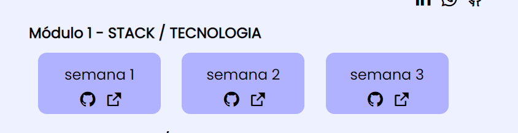
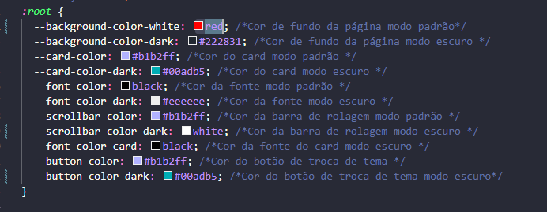
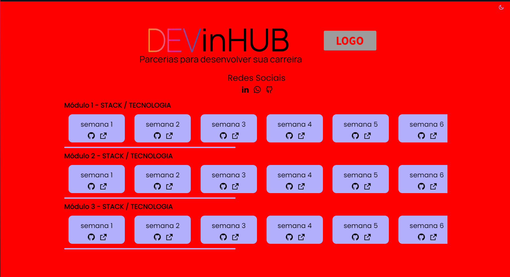
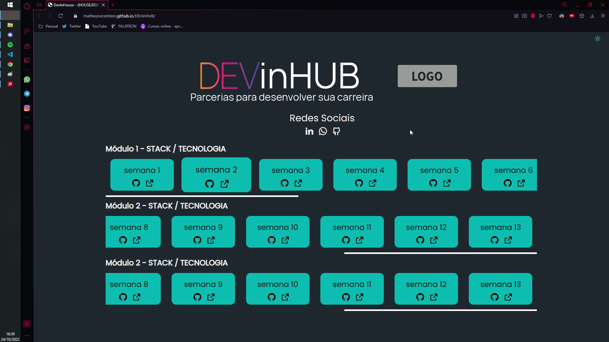

<p align="center"></p>

<p align="center">
 <h2 align="center">DEVinHUB - Portfolio para exercícios semanais</h2>
</p>
  <p align="center">
    <a href="">
      
    </a>
    <a href="">
      
    </a>
    <a href="">
      
    </a>
  </p>
   <p align="center">hospedado em: <a href="https://matheusvicentesn.github.io/DEVinHUB/">Github Pages</a> </p>

## Sobre

Projeto pensado para alunos do curso DEVinHouse, para exposição dos exercícios que são passados semanalmente para resolução, juntando todos em um lugar para servir de um portfólio.

## Features

#### Criação de Cards Dinâmicos

Dentro do projeto, existe o script **'buildPage.js'** que monta todos os cards dinamicamente. Onde para edição basta mudar as informações dentro do array. **Exemplo:**

```
const module1 = [
  {
    semana: "semana 1",
    linkgit: "www.github.com.br",
    linkpages: "www.github.com.br",
  },
  {
    semana: "semana 2",
    linkgit: "www.github.com.br",
    linkpages: "www.github.com.br",
  },
  {
    semana: "semana 3",
    linkgit: "www.github.com.br",
    linkpages: "www.github.com.br",
  }
];
```

**Resultado:**

<p align="center"></p>

#### Fácil edição da estilização

Todas as cores do projeto estão em variáveis para facilitar a edição dos estilos até para quem não tem muita prática. **Exemplo:**

<p align="center"></p>

**Resultado:**

<p align="center"></p>

#### Temas - modo escuro/modo claro



#### Totalmente responsivo

<p align="center"></p>


### A ser desenvolvido

Melhorias que poderão ser feitas no projeto posteriormente.

- [ ] Vídeo de demonstrando como realizar todas as modificações


### Contato
Qualquer pessoa pode contribuir com o projeto! 
Projeto desenvolvido com intuito de ajudar todos que estão cursando DEVinHouse.
Qualquer dúvida ou sugestão estou disponível no e-mail:
<a href="mailto:contato@matheusvicente.dev.br?subject=Questions" title=""> contato@matheusvicente.dev.br</a>
